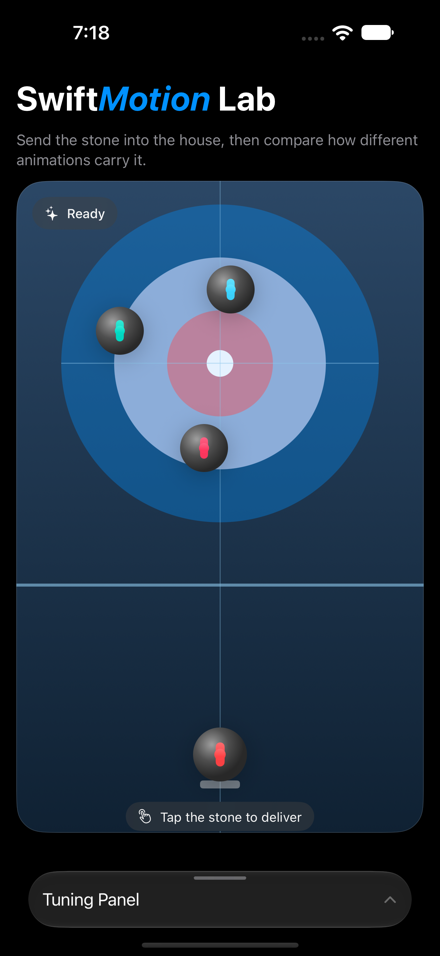
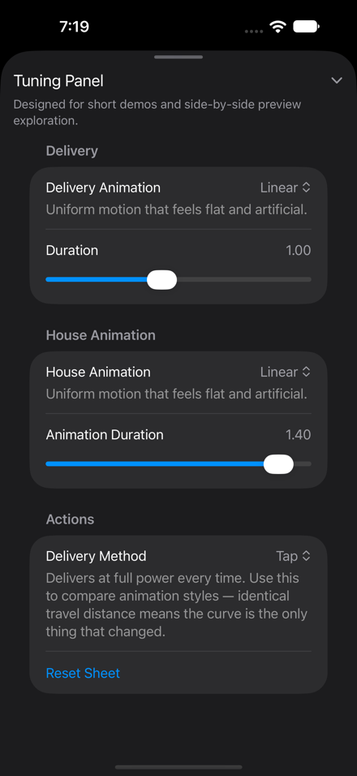
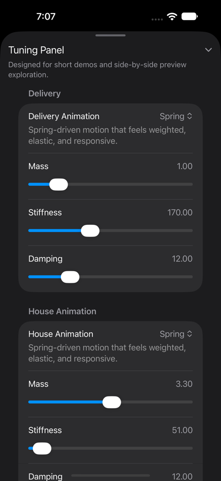
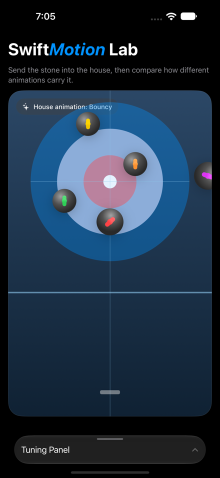
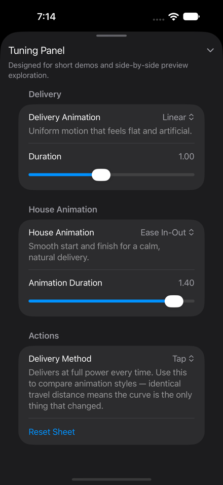
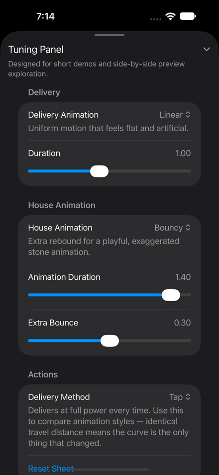

# Swift*Motion* Lab
## About this demo
The demo simulates a classroom. Attendees play the role of students learning to animate user interfaces in SwiftUI; the presenter plays the role of the teacher, who has a prepared a mobile app learning experience using Xcode coding agents. Animations are critical in creating expressive user interfaces that are fluid and immersive - and programming them are must-have skills for an app developer. While the app has been designed intentionally to teach specific technical learning outcomes, its demonstration purpose is not focused on what it teaches but how it does so: thorugh an experiential interactive lab that can be designed by anyone with the help of coding agents in Xcode 27.
## Requirements
Participants need complete the following steps prior to the demo:
- [ ] Install Xcode 27 through the AppStore or from [https://developer.apple.com](https://developer.apple.com/services-account/download?path=/Developer_Tools/Xcode_27/Xcode_27.xip) with a developer account.
- [ ] Run Xcode 27 to complete the installation of developer tools and iOS27 simulators and agentic code models.
- [ ] To follow the agentic coding demo, Xcode must be configured with a coding agent. *
*_Claude is recommended for this demo but similar results may be achieved with any configurable agent. A "pro" subscription may be required in order to avoid task limitations. If a coding agent is not available, participants can skip the agentic coding section of the demo._
- [ ] Load the starting project, by opening the `SwiftMotionLab.xcodeproj` file in Xcode 27.
- [ ] Run the app on an iPhone or iPad simulator. 
- [ ] Tap the stone at the starting hog line to deliver it into the house

> **Note:** This repo's `CLAUDE.md` tells coding agents not to read this file — its solutions would spoil the exercises in Demos 3 and 4. That's intentional lab design, not an oversight; agents work from the code's own comments instead.

## Overview
The app is a small curling-themed "motion lab" called SwiftMotion Lab. A stone is delivered up the ice toward a randomly arranged house of target stones; when it reaches one, the struck stone reacts — flung off in a random direction using a selected animation then faded out. A tuning panel sits alongside the play area with sliders for whichever animation style is currently selected. The tuning panel is a recommended practice and can be itself built entirely with coding agents to support the tuning of the animations used in the UI/UX of any app.

The goals of the demo are to:
- Feel what an animation curve actually does, on a phone, before reading a definition of one.
- Use a coding agent to extend a real app with a new animation style and learn how do so in the process.
- Demonstrate understanding by explicitly programming other animation styles to see that the hand-written and agentic coded features coexist and complement each other demonstrating how to learn with AI coding agents as well as the future of co-development that is of interest specifically to computer science educators and students



## The app at a glance

The project follows a small, layered structure with one view model that owns the state of the app and two plain "animator" structures that implement the actual SwiftUI animations for the delivery of the stone and the house stones that get "hit". The tuning panel has tuning controls from whichever parameters the selected style declare so that new animations can be added without having to also change the tuning UI.

```
SwiftMotionLabApp
└── ContentView                    owns the single source of truth
    ├── MotionLabRinkView          the full rink: ice, neighbours, played sheet
    │   └── CurlingSheetView       one played sheet
    │       ├── SheetMarkingsView  house rings, lines, and the hack
    │       ├── StoneView          one target stone already standing in the house
    │       └── DeliveredStoneView wraps StoneView for the stone being thrown
    └── ControlPanelView           mutates state, generated from the animation-style enums
```

Two of these types repeat by design, once for delivery and once for the house: a **style enum** (`DeliveryAnimationStyle`, `HouseAnimationStyle`) is a lookup table — it names a style, describes it for the panel, and declares which tunables it wants, with no behaviour of its own. An **animator** (`DeliveryAnimator`, `HouseAnimator`) is a plain value that turns a style plus its tuning values into a SwiftUI `Animation`, and reports how long it plays; the delivery animator additionally reports when the thrown stone *looks* like it has arrived, which is not the same fraction of the play time for every curve. `TuningValues.swift` holds one set of tuning values per style, plus the catalog of tunables the panel can render — title, key path, range, caption. `ControlPanelView` builds its sliders from whichever catalog entries the selected style declares, which is why adding a style never means editing that file.

### Application Files
| File | What it does |
|---|---|
| `SwiftMotionLabApp.swift` | App entry point |
| `SwiftMotionLab.icon` | The app's icon |
| `Assets.xcassets` | Application resources |

### Views
| File | What it does |
|---|---|
| `Views/ContentView.swift` | Side-by-side or stacked-with-sheet layout, depending on screen width |
| `Views/ControlPanelView.swift` | The tuning panel — its sliders are generated from the selected style's parameters; nobody edits this file to add a slider. Carries previews parameterized over every delivery and house style. |
| `Views/CurlingSheetView.swift` | One played sheet — the markings, the target stones, and the delivered stone |
| `Views/SheetMarkingsView.swift` | The static paint on a sheet: house rings, lines, and the hack |
| `Views/StoneView.swift` | Renders one piece of granite, target or delivered |
| `Views/DeliveredStoneView.swift` | Wraps `StoneView` for the delivered stone; owns its tap and flick gestures |
| `Views/MotionLabRinkView.swift` | The full rink: ice, faded neighbouring sheets, and the played sheet |


### ViewModels
| File | What it does |
|---|---|
| `ViewModels/MotionLabViewModel.swift` | State and the delivery sequence; builds no animation itself |

### Models
| File | What it does |
|---|---|
| `Models/CurlingSheet.swift` | The sheet's geometry and random house generation |
| `Models/Stone.swift` | The stone model shared by target stones and the delivered stone |
| `Models/DeliveryAnimator.swift` | The delivery animation style and the animator that builds its `Animation` |
| `Models/HouseAnimator.swift` | The house animation style and the animator that builds its `Animation`, for the struck stone |
| `Models/TuningValues.swift` | The per-style tuning values, and the parameter catalog the panel's sliders are generated from |

### Supporting Files
| File | What it does |
|---|---|
| `PreviewSupport/PreviewData.swift` | Named delivery/house scenario constants, and a `MotionLabViewModel` factory for previews that only need the panel |
| `PreviewSupport/PreviewScenarios.swift` | Named previews for demoing several states at once |

The tuning panel is a recommended best-practice enabled by the ease with which it can be coded using coding agents. The tuning panel is designed to read the declared parameters of an animation style and display the appropriate tuning sliders. 



## Demo 1 — Experiential learning with apps on iPhone

Run the app and tap the stone a few times before any code is discussed. Both the throw
and the hit are animated using a linear animation and move at a constant speed and stop dead — no settling, no follow-through. Dragging the Duration slider up or down changes how long the motion takes, but never how it feels. This is `.linear` animation, SwiftUI's plainest timing curve, and the app's deliberate starting state.

## Demo 2 — Agentic coding with Xcode

A more sophisticated animation is introduced, an interpolated spring, a spring declared in physical terms using **mass** (how heavy the stone feels),**stiffness** (how hard the spring pulls back to rest), and **damping** (how quickly the wobble dies out). A coding agent is asked to add one to the app, using the terminology presented.

The agent is instructed with the following prompt:

```
I want the stones to feel lively on the ice — both when they're thrown and when they get hit.
Add a spring animation with tunable mass, stiffness, and damping, and let me tune the throw and the
hit separately using the tuning panel. Don't run the app — just implement the code and leave mark
comments so I can review the code and add new styles myself.
```

The agent adds a new case to both animation-style enums and wires each to the independent spring already tunable per phase — reusing the Mass, Stiffness, and Damping catalog entries already declared in `TuningValues.swift`, which is why they appear in both sections of the panel without the agent touching that file. There is no Duration slider for a spring, because a spring's settling time is a consequence of its physics, not a value that is set directly.



With the spring in place, compare the new animation against Linear over identical travel distance then evaluate
*which animation fits better, and for which kind of interface element?* A progress bar or a clock
hand suits Linear; anything a finger touches and expects to respond to suits a spring.



The takeaway is that agents are powerful collaborators. They can extend a simple app like this one
effortlessly, generating whole tuning panels so a team can dial in exactly the right feel for a
real interaction — a card that snaps into place, a sheet that settles, a button that responds to a
press. The same process that is used by professional developers can be used by teachers of all subjects 
to generate immersive and engaging learning experiences. 

## Demo 3 — Programming animations (Ease In-Out) 

Where the agent wrote the spring, attendees now write the next style themselves, in one file:
`Models/HouseAnimator.swift`. Rather than copy-pasting the spring case, they add a bare enum case
and let the compiler name every place that needs attention, one build at a time:

**1. `HouseAnimationStyle` — add a new animation case**

```swift
case linear, easeInOut
```

**2. `HouseAnimationStyle.title`**

```swift
case .easeInOut: 
    return "Ease In-Out"
```

**3. `HouseAnimationStyle.description`**

```swift
case .easeInOut:
    return "Smooth start and finish for a calm, natural delivery."
```

**4. `HouseAnimationStyle.parameters`**

```swift
case .linear, .easeInOut: 
    return [.duration]
```

**5. `HouseAnimator.animation`**

```swift
case .easeInOut: 
    selectedAnimation = .easeInOut(duration: _tuning.duration)
```

**6. `HouseAnimator.playDuration`**
```swift
case .linear, .easeInOut: 
    play = _tuning.duration
```

Running the app and switching House Animation to Ease In-Out at the same duration as Spring shows
a visibly different feel: the stone lands exactly on its mark, with no wobble at all.



## Demo 4 — Programming animations (Bouncy) [optional]

If time allows, the same six-step recipe adds `bouncy`, which is the same spring machinery as
Interpolating Spring, described in perceptual rather than physical terms. A bouncy animation is tuned using two 
parameters: duration and extra bounce.



## Learning Outcomes

### SwiftUI Animation

- SwiftUI ships real, distinctly-named animations — Linear, Spring, Ease In-Out, Bouncy. The lab app names its picker entries drives the exact terminology to allow students to learn them and their behaviour.
- Animations are critical in creating expressive user interfaces that are fluid and immersive - and programming them are must-have skills for an app developer.
- App developers can add animation tuning panels to their app using coding agents. This recommended practice allows them to tune the animation aspects of their user interface to achieve the desired user experience.
- How to add specific animations to user interface elements

### Teaching and Learning with AI

- Teaching with AI and Swift doesn't require being a developer. Coding agents let anyone build an
  intentional, interactive experience and iterate on it quickly — whether the subject is app
  development, biology, or art.
- A small mobile app, built with Swift, Xcode, and agentic development, turns an abstract concept
  into something student can experience on their phone.
- Coding agents can be powerful learning collaborators: one added a real animation, independently
  tunable on both the throw and the hit, in about a minute.
- Xcode's agents are designed to keep the developer in control. At every step, authors read
  the generated code and decided what to keep — the agent proposes, ask questions proactively and 
  it does not take over
- When used for teaching programming students can use agents to learn from and must demonstrate understanding by coding themselves similar features to preserve their agency and intellectual autonomy.

## Next steps and further reading

- Set the delivery spring and the house spring to opposite feels — one stiff, one loose — and
  watch a single delivery show two distinct qualities of motion.
- Add an `easeInOut` case to the delivery side, in `DeliveryAnimator.swift`, the same way it was
  added to the house side.
- Switch Delivery Method to Flick to play with a real gesture-driven throw — fun, but not a tool
  for comparing animation styles, since its travel distance varies throw to throw.
- Add an `AnimatedProperty` picker (x, y, opacity, rotation, scale) so animations can be paired with
  any property on the struck stone — try Bouncy together with Opacity and watch what happens.
- For educators: ask an Xcode agent to build a tuning lab for a different subject like biology, math or art using a panel over whatever variables that subject has.
- Watch the WWDC26 session, "[Create UI prototypes using agents in Xcode"](https://developer.apple.com/videos/play/wwdc2026/227) for guidance on developing UI protoypes and tuning panels.
- To learn more about using coding agents and their capabilities, watch the "[Xcode, agents, and you](https://developer.apple.com/videos/play/wwdc2026/259)" from WWDC26.

